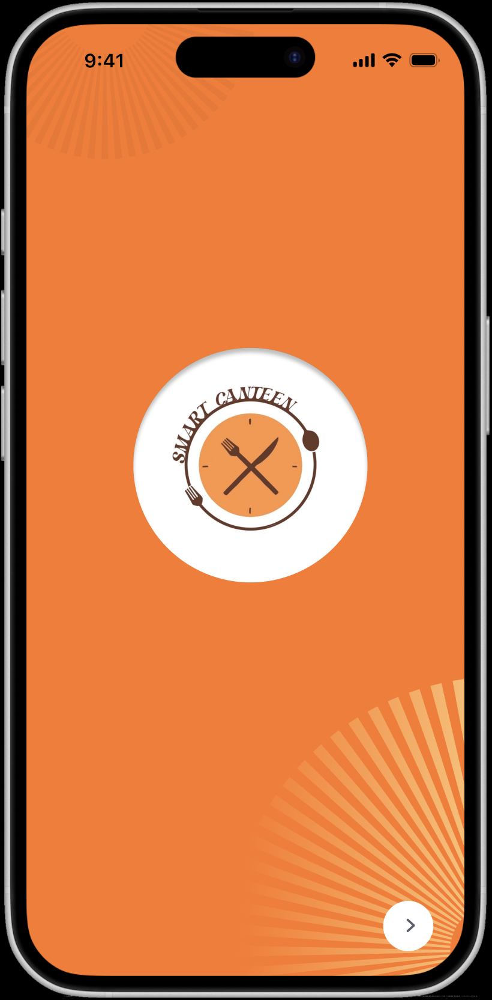
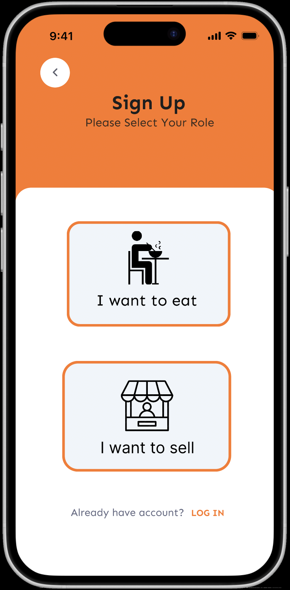
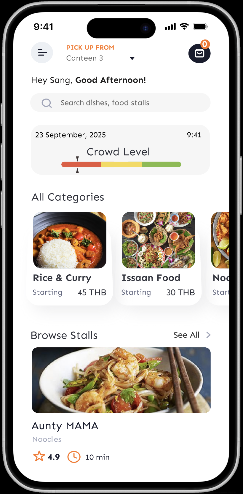
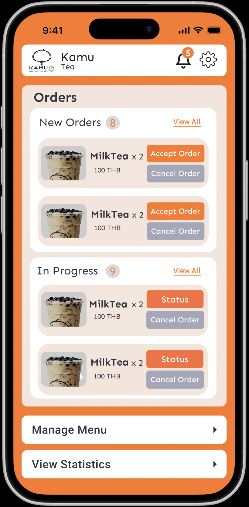
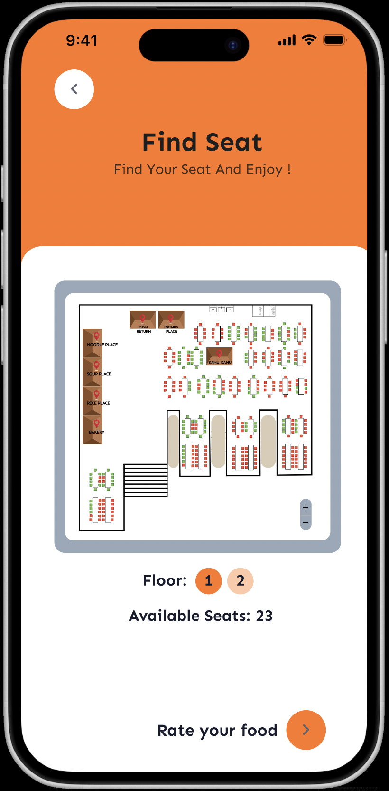
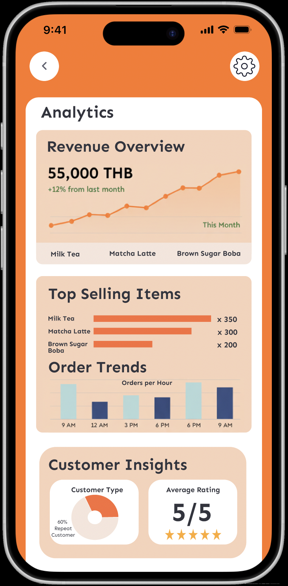

# Smart Canteen

## Project Overview

Smart Canteen is a mobile application designed to improve the campus dining experience for university students, staff, and canteen vendors. The app allows users to browse menus, place food orders in advance, track meal preparation in real time, and avoid long queues. It also provides a crowd level indicator and a seat availability map, helping users plan meal times more efficiently.

For vendors, Smart Canteen includes tools to update menus, manage orders, view analytics, and monitor business performance. This repository contains the full UI/UX design process, including wireframes, user flows, high-fidelity screens, and the interactive prototype.

---

## Purpose

University canteens often become crowded during peak hours, resulting in long waiting times and inconvenience. Smart Canteen addresses these challenges by offering:

- Advance ordering to reduce queue time  
- Real-time meal preparation tracking  
- Crowd-level monitoring  
- Seat availability mapping  
- Vendor dashboards  
- Vendor analytics  
- Simple and efficient menu management  

The app enhances the dining experience for both customers and canteen vendors.

---

## Figma Prototype

Full interactive design and prototype:  
**https://www.figma.com/design/DJmBrTGHS77N8oeKD6HEho/Smart-Canteen?node-id=0-1&t=KGuewBqe5blL5vCm-1**

---

## Key Screens

Below are selected high-fidelity screens representing core functionalities.  
Full screenshots are located in `assets/screenshots/`.

### Welcome Page  

### Signup Page  

### Customer Dashboard  

### Vendor Dashboard  

### Seat Map  

### Vendor Analytics  

---
## Design Tools Used

- Figma – Wireframes, high-fidelity UI design, prototyping
